# LLM Fine-tuning Guide

---

## Prompting Engineering vs. RAG vs. Fine-tuning

### Decision Framework

<details>
<summary>Comprehensive Guide to Choosing the Right Approach</summary>

---

- **Start with prompt engineering** in most scenarios instead of directly fine-tuning models
- **Use prompt engineering with either open-weight or closed-source models**
- **Apply techniques like few-shot prompting or retrieval augmented generation (RAG)** to efficiently tackle numerous problems without SFT
- **Build robust evaluation pipeline** with prompt engineering to measure metrics like accuracy, cost, and latency
- **Explore instruction dataset creation** if prompt engineering results don't match requirements
- **Consider fine-tuning as an option** when enough data is available

  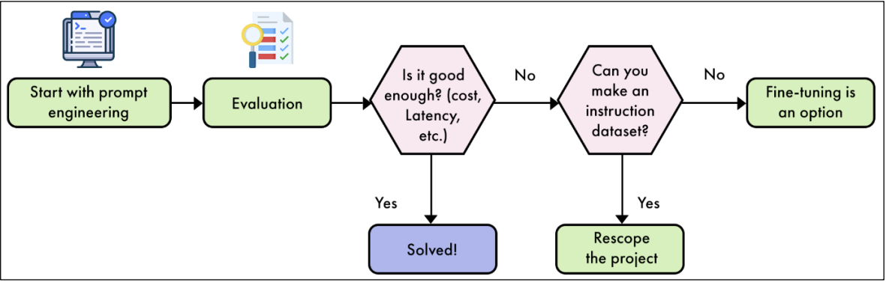

#### Fine-tuning Advantages

- **Control and data ownership** - "know your data" principle
- **Customizability** - the fine-tuned model becomes unique to your use case
- **Diverse LLM interactions** - enables tool analytics, moderation, and additional context beyond chatbot applications
- **Alternative solutions available** - several LLM providers offer automated fine-tuning services for limited ML engineering resources

---

#### Fine-tuning Limitations

- **Knowledge distance constraints** - difficult to learn content too distant from pre-training data (unknown or rare languages)
- **Increased hallucination risk** - studies show fine-tuning on new knowledge can result in more frequent hallucinations
- **Catastrophic forgetting** - risk of erasing knowledge present in the base model depending on SFT technique used
- **Limited knowledge expansion** - SFT leverages and refocuses existing knowledge rather than adding entirely new capabilities

---

</details>

---

## Supervised Fine-Tuning

### Core Concepts

<details>
<summary>Essential Understanding of Supervised Fine-Tuning Process</summary>

---

- **Supervised Fine-Tuning (SFT)** is a crucial step in preparing LLMs for real-world applications
- **Follows initial pre-training phase** where an LLM learns to predict the next token in a sequence
- **Refines model capabilities** using carefully curated pairs of instructions and corresponding answers
- **Serves two primary purposes:**
  - Teaches the model to understand and follow a specific chat format, effectively transforming it into a conversational agent
  - Allows the model to adapt its broad knowledge base to excel in targeted tasks or specialized domains

#### Importance of SFT

- **Bridges the gap** between a model's general language understanding and its practical utility
- **Shapes LLM behavior** by exposing the model to examples of desired input-output patterns
- **Aligns with specific goals** whether they involve task completion (summarization, translation) or domain expertise (medical, legal knowledge)
- **Enhances performance** in intended areas while improving instruction-following and response coherence

#### Chapter Coverage

- Creating a high-quality instruction dataset
- SFT techniques
- Implementing fine-tuning in practice

---

</details>

### Dataset Creation

<details>
<summary>Comprehensive Guide to Creating High-Quality Instruction Datasets</summary>

---

- **Most difficult part** of the fine-tuning process in most use cases
- **Multiple challenges:**

  - Most use cases connect to raw text, but natural instruction-answer pairs are rare
  - Raw text needs transformation into instruction-answer format
  - Data quality is crucial requiring manual checking and verification
  - Careful review ensures dataset accuracy and training utility

  **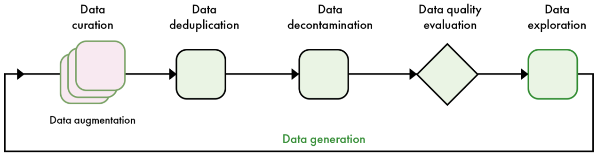**

#### General Framework

- **Instruction datasets defined** as pairs of instructions and answers
- **Instructions serve as inputs** - model context during fine-tuning
- **Answers are expected outputs** of the model
- **Training flexibility** - can train on instructions and answers, or answers only
- **Template structure** - pairs follow certain templates like Alpaca with additional fields:

  - **Inputs** - data the model needs to complete the instruction
  - **System** - meta-prompt to steer general model behavior

  **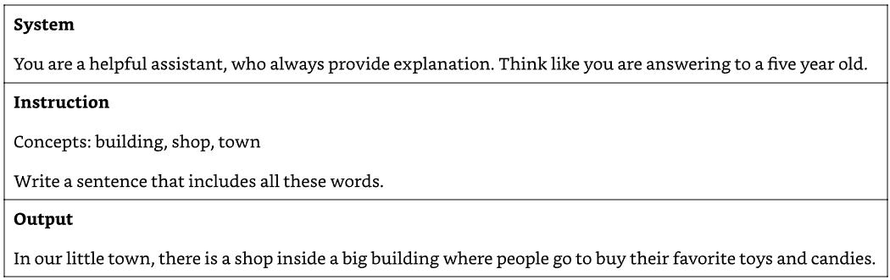**

#### Data Quality Dimensions

- **Accuracy** - factual correctness and relevance of samples, ensuring responses are factually accurate and relevant to instructions
- **Diversity** - wide range of use cases covering potential queries and tasks, spanning topics, contexts, text lengths, and writing styles
- **Complexity** - complex, multi-step reasoning problems and challenging tasks that push model boundaries beyond trivial samples

---

#### Data Quantity Guidelines

- **Hugging Face Hub** contains numerous instruction datasets for general-purpose or specific tasks/domains
- **Leverage existing datasets** for new use cases, especially when sample count is low (`<1,000`)
- **Quality and model size impact** - calculating ideal sample numbers is difficult due to these variables

**Large Models (70B parameters):**

- As low as `1,000` high-quality samples (LIMA paper reference)

**Smaller Models (7B parameters):**

- Need more samples to learn correct chat template
- Quality remains crucial factor
- Higher sample count always desirable

**Industry Examples:**

- **Yi models (01-ai):** `<10,000` samples
- **Meta Llama 3:** `10 million` samples (entire fine-tuning process including preference alignment)
- **OpenHermes/Dolphin:** `~1 million` samples
- **Recommendation:** At least `1 million` samples for good general-purpose instruct model

---

#### Model Type Requirements

**Task-Specific Models:**

- Designed to excel at particular functions (translation, summarization, sentiment analysis)
- Focused training approach on single task
- Efficient performance with smaller model sizes (`<8B` parameters)
- Data requirements: `100` to `100,000` samples
- Attractive option for resource-limited applications

**Domain-Specific Models:**

- Key factors determining data needs:
  - "Size" of domain (extent of specialized knowledge and vocabulary)
  - Representation in model's pre-training data
- Well-represented domains may require less fine-tuning
- Specialized/underrepresented domains need more extensive datasets
- Challenge: Many pre-training datasets are closed-source requiring educated guesses about composition

---

#### Data Curation Approaches

**Task-Specific Model Curation:**

- Collect examples of desired task from existing datasets or create new ones
- Gather original-summarized text pairs for summarization models
- Collect multi-language sentences for translation models

**Domain-Specific Model Curation:**

- More challenging approach
- Requires collaboration with subject matter experts
- Gather and validate relevant texts, research papers, technical documents
- May involve partnerships with organizations having specialized information repositories
- Quality and relevance crucial for model's domain understanding and generation capabilities

**Few-Shot Prompting Alternative:**

- Emerged as alternative strategy, especially for task-specific applications
- Leverages capabilities of large, powerful models with examples in input prompt
- Not replacement for all fine-tuning scenarios (e.g., learning new domains)
- Efficient way to adapt models without extensive additional training

**Practical Considerations:**

- Line between task-specific and domain-specific models can blur
- Example: Medical diagnosis model (both task-specific and domain-specific)
- Key: Understand primary goal and tailor approach accordingly

---

</details>

### Data Preprocessing

<details>
<summary>Advanced Techniques for Data Quality Control and Optimization</summary>

---

#### Rule-Based Filtering

- **Systematic approach** to data quality control using explicit, predefined rules
- **Designed to address** common quality issues ranging from simple to complex operations
- **Primary goal** - maintain high data quality standards by removing non-compliant samples

**Length Filtering:**

- **Straightforward technique** setting thresholds for acceptable response lengths
- **Remove extremes** - extremely short (insufficient information) and excessively long (irrelevant/redundant content)
- **Task-dependent thresholds** - concise summaries vs. detailed explanations require different limits

**Keyword Exclusion:**

- **Content-focused technique** using lists of low-quality or inappropriate keywords/phrases
- **Filter categories:**
  - Obvious quality indicators (profanities, spam terms)
  - Domain-specific irrelevant terms
  - Tone-inappropriate expressions for professional applications

**Format Checking:**

- **Ensures consistency** for structured data or specific formatting requirements
- **Particularly important** for code samples, JSON structures, formatted text
- **Example implementation** - verify code syntax correctness and style guideline compliance

**Advantages:**

- Speed and efficiency for large data volumes
- Consistent rule application reducing human error and bias
- Transparency and interpretability for easy understanding and auditing
- Automation capability reducing manual intervention

**Limitations:**

- Rules may lack nuance for language complexity and context
- Binary nature (pass/fail) may not align with nuanced language quality
- Requires regular review and updates as patterns evolve
- Risk of inadvertently introducing or amplifying dataset biases

---

#### Data Deduplication

- **Dataset diversity fundamental** for models that generalize well to unseen data
- **Duplicate/near-duplicate issues:**
  - Overfitting - models memorize specific examples vs. learning patterns
  - Biased performance toward overrepresented data points
  - Inefficient training with redundant data
  - Inflated evaluation metrics from duplicate test data

**Exact Deduplication:**

- **Removes identical samples** through straightforward process
- **Process steps:**
  - Data normalization (standardize format, convert to lowercase)
  - Hash generation (MD5, SHA-256 algorithms)
  - Hash comparison and duplicate removal
- **Limitation** - doesn't detect near-duplicates or semantically similar content

**Fuzzy Deduplication (MinHash):**

- **Most popular approach** maintaining high accuracy with reduced computational complexity
- **Process overview:**
  - Generate compact representations (signatures) for each data item
  - Signatures serve as fingerprints capturing data essence with reduced dimensionality
  - Transform data into shingle sets, apply multiple hash functions
  - Select minimum hash values forming signature vectors
  - Compare signatures using Jaccard similarity to identify near-duplicates

**Semantic Similarity Deduplication:**

- **Focuses on text meaning** for deduplication decisions
- **Vector representation techniques:**
  - Word embedding models (Word2Vec, GloVe, FastText)
  - Context-aware language models (BERT, sentence transformers, cross-encoders)
- **Comparison process:**
  - Convert words/samples to vector representations
  - Compare similarity using cosine similarity or Euclidean distance
  - Apply predefined similarity thresholds for duplicate identification
- **Clustering approach:**
  - Apply clustering techniques (K-means, DBSCAN, hierarchical clustering)
  - Group similar vectors efficiently
  - Retain representative samples from each cluster

---

#### Data Quality Evaluation

- **Critical aspect** of machine learning, particularly for LLMs
- **Assessment characteristics** - accuracy, diversity, complexity of datasets
- **Verification approaches:**
  - Mathematical accuracy easily verified (Python interpreters)
  - Subjective/open-ended content evaluation remains challenging

**Traditional Methods:**

- **Human annotation** - high accuracy but resource-intensive
- **Machine learning automation** addressing scalability issues:
  - LLMs as judges
  - Reward models
  - Classifiers trained for quality prediction

**Reliability Improvement Strategies:**

- **Multiple LLMs as jury** - reduce bias and improve consistency
- **Leverage smaller LLM jury** - reduce costs while increasing accuracy and mitigating intra-model favoritism
- **High agreement targets** - aim for `~80%` agreement between LLM judges and human evaluators for chatbot applications
- **Simple grading scales** with few-shot prompting and task-specific benchmarks
- **Ensure relevant and interpretable** evaluations

---

</details>

### SFT Implementation Techniques

<details>
<summary>Comprehensive Overview of Supervised Fine-Tuning Methods and Formats</summary>

---

#### Core SFT Process

- **Re-training pre-trained models** on smaller datasets composed of instruction-answer pairs
- **Primary goal** - turn base model (next-token prediction only) into useful assistant capable of answering questions and following instructions
- **Additional applications:**
  - Improve general performance (general-purpose SFT)
  - Instill new knowledge (languages, domains)
  - Focus on specific tasks
  - Adopt particular voice/style

#### Instruction Dataset Formats

- **Storage organization** for instructions and answers using specific formats
- **Python dictionary representation** with keys as prompt types (system, instruction, output) and values as actual text
- **Three standard formats:** Alpaca, ShareGPT, OpenAI

  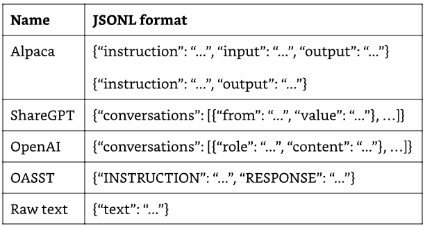

**Format Characteristics:**

- **Alpaca format** - optional "input" key appended to "instruction" content when present
- **Raw text format** - shows SFT similarity to pre-training ("continual pre-training" when re-training on raw text)
- **Single-turn vs. multi-turn:**
  - Alpaca sufficient for single instruction-answer pairs
  - ShareGPT/OpenAI better for conversations (multiple instructions-answers)
  - Storage choice depends on end use case

#### Chat Templates

- **Unified presentation** of instructions and answers to the model
- **Include special tokens** identifying message beginning/end and message author
- **Base model considerations:**
  - No inherent chat template (can choose any when fine-tuning)
  - Must use same template when fine-tuning instruct models (avoid performance degradation)

**Template Varieties:**

- ChatML, Llama 3, Mistral, and others
- **ChatML template (OpenAI origin)** - popular in open-source community
- **Special tokens:** `<|im_start|>` and `<|im_end|>` indicate speaker
- **Structure components:** system, user, assistant parts with speaker identification

  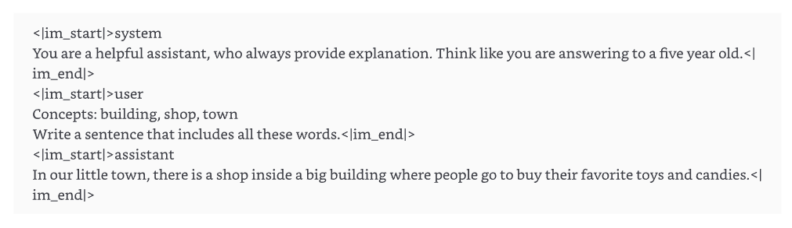

**Implementation Considerations:**

- **Critical precision** - every whitespace and line break extremely important
- **Wrong tokenization impact** - adding/removing characters negatively impacts performance
- **Recommended approach** - use reliable templates like Jinja (Transformers library implementation)
- **Training vs. inference** - same template used for both with add_generation_prompt parameter

  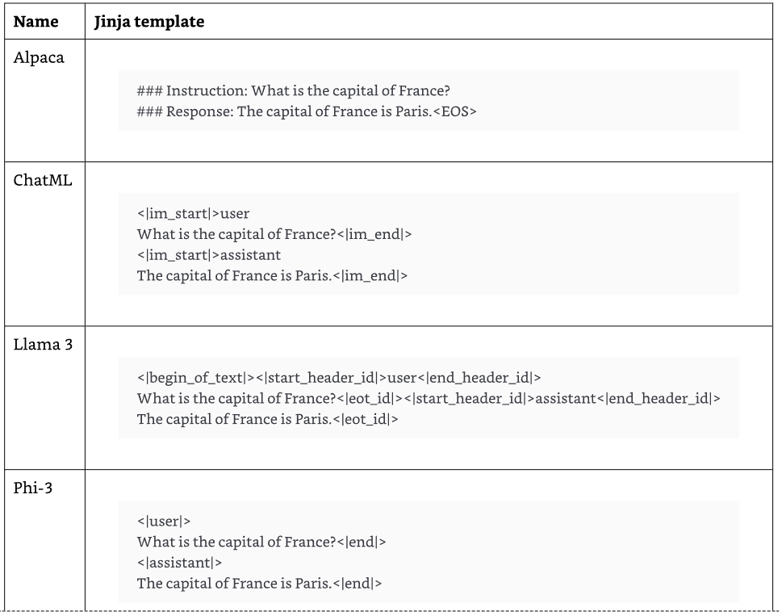
  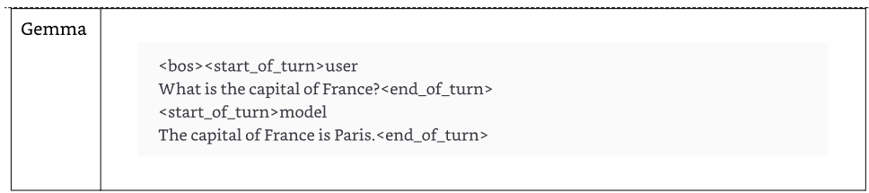

---

</details>

### Parameter-Efficient Fine-Tuning Methods

<details>
<summary>Complete Guide to Full Fine-Tuning, LoRA, and QLoRA Techniques</summary>

---

- **Three main SFT techniques** converged from literature: full fine-tuning, LoRA, and QLoRA
- **Individual technique analysis** with pros and cons for different use cases

  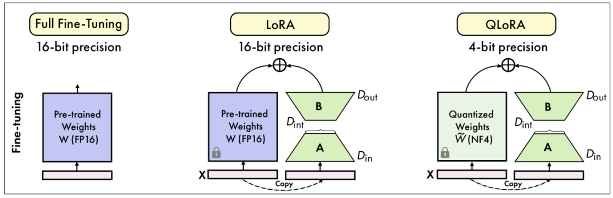

#### Full Fine-Tuning

- **Most straightforward SFT technique** - re-training every parameter in base model
- **Training objective** - next-token prediction (like pre-training)
- **Main difference** from continual pre-training is dataset structure
- **Often provides best results** but requires significant computational resources

**Memory Usage Estimation:**

- **Depends on factors:** model size, training techniques, optimization methods
- **Single-GPU setting formula:**

  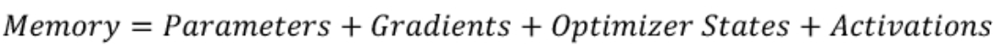

**32-bit floating point (fp32) precision components:**

- **Parameters:** Learnable weights and biases (attention mechanisms, feed-forward layers, embedding layers)
  - Cost: `4 bytes/parameter` (FP32) or `2 bytes/parameter` (FP16/BF16)
- **Gradients:** Partial derivatives of loss function with respect to each parameter
  - Computed through backpropagation for parameter updates
  - Cost: `4 bytes/parameter`
- **Optimizer states:** Additional values for optimization algorithms (Adam/AdamW)
  - Running averages of past gradients and squared gradients
  - Adapt learning rate and navigate loss landscape effectively
  - Cost: `8 bytes/parameter` (Adam optimizer)
- **Activations:** Intermediate outputs of each layer during forward pass
  - Kept in memory for gradient computation in backward pass
  - Cost: variable, often negligible for small batch sizes

**Memory Requirements:**

- **Baseline:** `16 bytes per parameter`
- **7B model:** `112 GB VRAM`
- **70B model:** `1,120 GB VRAM`
- **Often underestimate** - doesn't account for activations, temporary buffers, training technique overhead

**Memory Reduction Techniques:**

- **Model parallelism** - spread workload across multiple GPUs (adds overhead)
- **Gradient accumulation** - larger effective batch sizes without proportional memory increase
- **Memory-efficient optimizers** - 8-bit Adam reduces optimizer state footprint
- **Activation checkpointing** - trades computation for memory by recalculating activations
- **Combined techniques** - can reduce to `14-15 bytes per parameter` vs. `16-byte` baseline

**Limitations:**

- **Destructive nature** - directly modifies pre-training weights
- **Catastrophic forgetting** risk - may erase previous knowledge and skills if training doesn't behave as expected
- **High computational requirements** - parameter-efficient techniques often preferred for task/domain-specific models

---

#### LoRA (Low-Rank Adaptation)

- **Parameter-efficient technique** for fine-tuning LLMs
- **Addresses computational challenges** of adapting massive neural networks
- **Cornerstone technique** in LLM fine-tuning

**Primary Purpose and Advantages:**

- **Enable fine-tuning** with significantly reduced computational resources
- **Trainable low-rank matrices** modify model behavior without changing original parameters
- **Key benefits:**
  - Dramatically reduced memory usage during training
  - Faster fine-tuning process
  - Preservation of pre-trained model weights (non-destructive)
  - Ability to switch between tasks efficiently by swapping LoRA weights

**Mathematical Foundation:**

- **Low-rank decomposition technique** to update model weights efficiently
- **Formula:** `W' = W + BA`
  - `W` = original weight matrix
  - `B` and `A` = LoRA matrices
  - `W'` = effective weight matrix for inference
- **Matrix dimensions** chosen so `BA` product matches `W` shape with much lower rank
- **Training process** - original weights `W` remain frozen, only `A` and `B` updated

  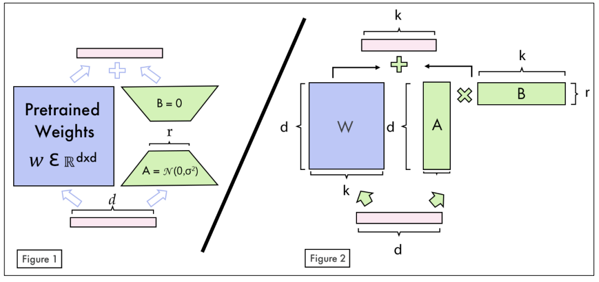

**Hyperparameters:**

- **Rank (r)** - determines LoRA matrix size
  - Common starting point: `r = 8`
  - Values up to `256` show good results in some cases
  - Larger ranks capture more diverse tasks but risk overfitting
- **Alpha (α)** - scaling factor applied to LoRA update
  - Updates frozen weights `W` by factor of `α/r`
  - Common heuristic: set `α` to twice the value of `r` (scaling factor of 2)
  - Experiment with different ratios for overfitting/underfitting cases
- **Dropout** - optional regularization factor (rate between `0` and `0.1`)

**Target Modules:**

- **Initially focused** on attention mechanism (query Q and value V matrices)
- **Extended applications** to additional components:
  - Key (K) matrices in attention layers
  - Output projection layers (O) in attention mechanisms
  - Feed-forward or Multi-Layer Perceptron (MLP) blocks
  - Linear output layers
- **Trade-off consideration** - more LoRA-adapted modules increase trainable parameters and memory requirements

**Performance Metrics:**

- **Memory efficiency** - fine-tune 7B parameter model on single GPU with `14-18 GB VRAM`
- **Dramatic reduction** vs. full fine-tuning requiring multiple high-end GPUs
- **Trainable parameters** - Llama 3 8B model with rank 16 targeting every module:
  - `42 million` trainable LoRA parameters out of `8 billion` total parameters
  - `0.5196%` of model's parameters
- **Quality comparison** - achievable comparable or better results than full fine-tuning
- **Multiple LoRA combination** - different task/domain weights for flexible deployment and task switching
- **Specialized serving** - LoRAX, Hugging Face TGI, Nvidia NIM support multiple-LoRA serving

---

#### QLoRA (Quantization-aware Low-Rank Adaptation)

- **Method combining** quantization techniques with LoRA for fine-tuning LLMs
- **Addresses high computational costs** allowing fine-tuning on small, widely available GPUs
- **Introduced by Dettmers et al.**

**Core Approach:**

- **4-bit NormalFloat (NF4) quantization** of base model parameters for significant memory reduction
- **Small trainable low-rank matrices** (adapters) to specific layers like LoRA
- **Only adapters updated** during training while original model weights remain unchanged
- **Double quantization** - quantizes the quantization constants themselves
- **Paged optimizers** - manage memory spikes using Nvidia unified memory feature

**Performance Comparison:**

- **Significant memory savings** vs. LoRA - up to `75%` reduction in peak GPU memory usage
- **7B model example:**
  - Initialization: `35%` reduction from `14 GB` to `9.1 GB`
  - Fine-tuning: `40%` reduction from `15.6 GB` (LoRA) to `9.3 GB` (QLoRA)
- **Training speed trade-off** - approximately `30%` slower than LoRA
- **Model performance** - shows only minor differences compared to LoRA

**Use Case Recommendations:**

- **QLoRA preferred** when memory constraints are primary concern
- **Ideal for** very large models or hardware with limited GPU memory
- **LoRA preferred** when training speed is crucial and sufficient memory available
- **Decision factors** - project requirements, available hardware, need to balance memory usage, training speed, and model performance

---

</details>

### Training Configuration

<details>
<summary>Essential Hyperparameters and Training Parameters for Effective Fine-Tuning</summary>

---

#### Learning Rate and Scheduler

**Learning Rate:**

- **Most important hyperparameter** controlling parameter update magnitude during training
- **Typical range:** `1e-6` to `1e-3`
- **Common starting point** for transformer models: `1e-5`
- **Impact of incorrect values:**
  - Too low: slow progress, stuck in suboptimal solutions
  - Too high: unstable training, divergence, poor performance
- **Experimentation recommended** to find optimal value for specific task and model

**Learning Rate Scheduler:**

- **Adjusts learning rate** throughout training process
- **Typical pattern:** higher initial rate for rapid progress, gradual decrease for precise fine-tuning
- **Common types:**
  - **Linear scheduler** - steady decrease over time
  - **Cosine scheduler** - cosine curve pattern (slow then rapid decrease)
- **Example configuration:**
  - Start: `3e-4`, End: `1e-7`
  - Warmup period: `5%` of total steps (increase from 0 to initial value)
  - Decay period: remaining `95%` of steps
- **Performance** - linear and cosine schedulers provide same level of performance

#### Batch Size and Gradient Accumulation

**Batch Size:**

- **Determines samples processed** before model weight updates
- **Typical range:** `1` to `32` (common values: `1, 2, 4, 8, 16`)
- **Larger batch benefits:**
  - More stable gradient estimates
  - Improved training speed
  - Better approximation of true dataset gradient
- **Memory constraints** - limiting factor on GPUs with less VRAM
- **Hardware examples:**
  - High-end GPU (24GB): batch size `16`
  - Smaller GPU (8GB): batch size `2` or `4`

**Gradient Accumulation:**

- **Overcomes memory constraints** while benefiting from larger effective batch sizes
- **Process:** multiple forward/backward passes with smaller mini-batches, accumulating gradients before single update
- **Example configuration:**
  - Desired effective batch size: `32`
  - GPU limitation: `8` samples at once
  - Gradient accumulation steps: `4`
  - Result: process `4` mini-batches of `8` samples each
- **Steps range:** `1` (no accumulation) to `8` or `16`
- **Trade-off:** more steps allow larger effective batch sizes but increase update time

**Effective Batch Size Formula:**

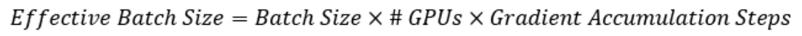

- **Example calculation:** `2 GPUs × 4 batch size × 4 accumulation steps = 32 effective batch size`

#### Sequence Length and Packing

**Maximum Sequence Length:**

- **Determines longest input** the model can process
- **Typical range:** `512` to `4,096` tokens (can extend to `128,000+`)
- **Common configurations:**
  - `2,048` tokens for many language generation tasks
  - `8,192+` tokens for RAG applications
- **Truncation handling:**
  - Left truncation (beginning removal)
  - Right truncation (end removal)
  - Example: `1,500`-token input with `1,024` max length removes `476` tokens
- **Memory impact:** directly affects batch size and memory usage
  - Batch size `12` × max length `1,024` = `12,288` tokens
  - Batch size `12` × max length `512` = `6,144` tokens

**Packing:**

- **Maximizes training batch utilization** by combining multiple smaller samples
- **Example:** max length `1,024` with samples `200-300` tokens can fit `3-4` samples per batch slot
- **Efficiency improvement** especially for datasets with many short sequences
- **Implementation requirement:** careful attention masking to prevent cross-sample attention
- **Attention masks** prevent model from attending to tokens from different samples within packed sequence

#### Training Duration and Optimization

**Number of Epochs:**

- **Complete passes** through entire training dataset
- **Typical range:** `1` to `10` epochs (successful runs often use `2` to `5`)
- **Determining factors:**
  - Task complexity
  - Dataset size
  - Model architecture
- **Trade-off considerations:**
  - Too few epochs: underfitting
  - Too many epochs: overfitting
- **Configuration examples:**
  - Large model + small dataset: `1-3` epochs
  - Smaller model + larger dataset: `5-10` epochs
- **Best practices:**
  - Monitor validation performance during training
  - Implement early stopping for plateau/degradation
  - Dynamic optimal epoch determination

**Optimizers:**

- **AdamW (Adaptive Moment Estimation with Weight Decay)** highly recommended
- **8-bit AdamW** performs comparably to 32-bit version with less GPU memory (no training speed improvement)
- **AdamW benefits:**
  - Combines adaptive learning rates with weight decay regularization
  - Better training stability and model performance
- **AdaFactor alternative** for severe memory constraints
  - Works well without explicit learning rate tuning
  - Useful in resource-constrained environments
  - May not match AdamW performance in all cases
- **Paged optimizers** for extremely large models or limited GPU memory
  - Paged AdamW 8-bit offloads to CPU RAM
- **Non-quantized adamw_torch** for maximum performance when memory allows

**Weight Decay:**

- **Regularization technique** adding penalty for large weights to loss function
- **Encourages simpler, generalizable features** avoiding over-reliance on single input features
- **Typical range:** `0.01` to `0.1` (common starting point: `0.01`)
- **Example with AdamW:** weight decay `0.01`
- **Balance considerations:**
  - Too high: impedes learning of important patterns
  - Too low: insufficient regularization
- **Optimization approach** - experiment with different values for specific model architecture and dataset

**Gradient Checkpointing:**

- **Memory reduction technique** storing only subset of intermediate activations from forward pass
- **Standard training** retains all intermediate activations for gradient calculation during backward pass
- **Challenge** - deep networks like LLMs quickly become impractical due to hardware limitations
- **Solution approach:**
  - Selectively save activations at specific layers
  - Recompute non-saved activations during backward pass as needed
- **Trade-off** - computation time vs. memory usage
  - Significantly reduces memory requirements
  - May increase overall computation time due to activation recalculation

---

</details>

### Practical Implementation

<details>
<summary>Complete Step-by-Step Guide to Fine-Tuning with Real Code Examples</summary>

---

#### Model Selection Criteria

**Three main parameters for LLM selection:**

- **License** - some models restrict commercial use, custom licenses may target companies with specific user thresholds
- **Budget** - smaller parameter models (`<10B`) cheaper to fine-tune and deploy, run on cheaper GPUs, process more tokens per second
- **Performance** - evaluate base model on general-purpose benchmarks or domain/task-specific benchmarks relevant to final use case

**Example Choice: Llama 3.1 8B:**

- **Permissive custom license** ("Llama 3.1 Community License Agreement") allows commercial use
- **8B parameters** - small enough for most GPUs while maintaining high performance vs. competitors
- **Verification sources** - Open LLM Leaderboard and model card benchmarks

#### Recommended Tools and Libraries

**TRL (Transformers Reinforcement Learning):**

- Created and maintained by Hugging Face
- Train LLMs using SFT and preference alignment
- Popular and reliable, most up-to-date algorithms
- Single and multi-GPU settings with FSDP and DeepSpeed support

**Axolotl:**

- Created by Wing Lian
- Streamlines LLM fine-tuning with reusable YAML configuration files
- Based on TRL with additional features
- Automatically combines datasets in various formats
- Single and multi-GPU settings with FSDP and DeepSpeed support

**Unsloth:**

- Created by Daniel and Michael Han
- Custom kernels for speed improvement (`2-5x`) and memory reduction (up to `80%` less)
- Based on TRL with utilities like automatic GGUF quantization format conversion
- Currently single-GPU settings only

#### Complete Implementation Example

**Environment Setup:**

```python
import os
from getpass import getpass

hf_token = getpass("Enter your Hugging Face token. Press Enter to skip: ")
enable_hf = bool(hf_token)
print(f"Is Hugging Face enabled? '{enable_hf}'")

comet_api_key = getpass("Enter your Comet API key. Press Enter to skip: ")
enable_comet = bool(comet_api_key)
comet_project_name = "second-brain-course"
print(f"Is Comet enabled? '{enable_comet}'")

if enable_hf:
    os.environ["HF_TOKEN"] = hf_token
if enable_comet:
    os.environ["COMET_API_KEY"] = comet_api_key
    os.environ["COMET_PROJECT_NAME"] = comet_project_name
```

**GPU Detection and Parameter Adjustment:**

```python
import torch

def get_gpu_info() -> str | None:
    if not torch.cuda.is_available():
        return None

    gpu_name = torch.cuda.get_device_properties(0).name
    return gpu_name

active_gpu_name = get_gpu_info()

dtype = None
if active_gpu_name and "T4" in active_gpu_name:
    load_in_4bit = True
    max_steps = 25
elif active_gpu_name and ("A100" in active_gpu_name or "L4" in active_gpu_name):
    load_in_4bit = False
    max_steps = 250
elif active_gpu_name:
    load_in_4bit = False
    max_steps = 150
else:
    raise ValueError("No Nvidia GPU found.")
```

**Model and Tokenizer Loading:**

```python
from unsloth import FastLanguageModel

max_seq_length = 4096
base_model = "Meta-Llama-3.1-8B-Instruct"
model, tokenizer = FastLanguageModel.from_pretrained(
    model_name=f"unsloth/{base_model}",
    max_seq_length=max_seq_length,
    dtype=dtype,
    load_in_4bit=load_in_4bit,
)
```

**LoRA Configuration:**

```python
model = FastLanguageModel.get_peft_model(
    model,
    r=16,
    target_modules=[
        "q_proj", "k_proj", "v_proj", "o_proj",
        "gate_proj", "up_proj", "down_proj",
    ],
    lora_alpha=16,
    lora_dropout=0,
    bias="none",
    use_gradient_checkpointing="unsloth",
    random_state=3407,
    use_rslora=False,
    loftq_config=None,
)
```

**Data Preparation:**

```python
from datasets import load_dataset

alpaca_prompt = """Below is an instruction that describes a task, paired with an input that provides further context. Write a response that appropriately completes the request.

### Instruction:
You are a helpful assistant specialized in summarizing documents. Generate a concise TL;DR summary in markdown format having a maximum of 512 characters of the key findings from the provided documents, highlighting the most significant insights

### Input:
{}

### Response:
{}"""

EOS_TOKEN = tokenizer.eos_token

def formatting_prompts_func(examples):
    inputs = examples["instruction"]
    outputs = examples["answer"]
    texts = []
    for input, output in zip(inputs, outputs):
        text = alpaca_prompt.format(input, output) + EOS_TOKEN
        texts.append(text)
    return {"text": texts}

dataset = load_dataset(dataset_id)
dataset = dataset.map(
    formatting_prompts_func,
    batched=True,
)
```

**Training Configuration:**

```python
from transformers import TrainingArguments
from trl import SFTTrainer
from unsloth import is_bfloat16_supported

trainer = SFTTrainer(
    model=model,
    tokenizer=tokenizer,
    train_dataset=dataset["train"],
    dataset_text_field="text",
    max_seq_length=max_seq_length,
    dataset_num_proc=2,
    packing=True,
    args=TrainingArguments(
        per_device_train_batch_size=2,
        per_device_eval_batch_size=2,
        gradient_accumulation_steps=4,
        warmup_steps=5,
        max_steps=max_steps,
        learning_rate=2e-4,
        fp16=not is_bfloat16_supported(),
        bf16=is_bfloat16_supported(),
        logging_steps=1,
        optim="adamw_8bit",
        weight_decay=0.01,
        lr_scheduler_type="linear",
        seed=3407,
        output_dir="outputs",
        report_to="comet_ml" if enable_comet else "none",
    ),
)

trainer_stats = trainer.train()
```

**Training Success Evaluation:**

- **Experiment tracker requirement** (Comet) for visualizing training metrics:
  - Loss progression
  - Gradient norm
  - Learning rate changes
- **Automatic logging** with `report_to=comet_ml` parameter and environment variables setup

**Model Saving and Registry Upload:**

```python
from huggingface_hub import HfApi

model_name = f"{base_model}-Second-Brain-Summarization"
model.save_pretrained_merged(
    model_name,
    tokenizer,
    save_method="merged_16bit",
)  # Local saving

if enable_hf:
    api = HfApi()
    user_info = api.whoami(token=hf_token)
    huggingface_user = user_info["name"]
    print(f"Current Hugging Face user: {huggingface_user}")

    model.push_to_hub_merged(
        f"{huggingface_user}/{model_name}",
        tokenizer=tokenizer,
        save_method="merged_16bit",
        token=hf_token,
    )  # Online saving to Hugging Face
```

**Model Registry Benefits:**

- **Centralized repository** tracking all model lifecycle aspects
- **Critical question answers:**
  - Best version location for auditing, testing, deployment
  - Training methodology documentation
  - Runtime dependencies tracking
  - Compliance documentation maintenance
- **Production bridge** - central source of truth across development, validation, deployment, monitoring stages
- **LLM-specific importance** - extensive documentation for training data, potential biases, intended use cases

#### Inference Implementation

**Model Loading for Inference:**

```python
dataset_name = "pauliusztin/second_brain_course_summarization_task"
model_name = "pauliusztin/Meta-Llama-3.1-8B-Instruct-Second-Brain-Summarization"

from unsloth import FastLanguageModel

model, tokenizer = FastLanguageModel.from_pretrained(
    model_name=model_name,
    max_seq_length=8192,
    load_in_4bit=True,
)
FastLanguageModel.for_inference(model)  # Enable native 2x faster inference
```

**Text Generation Function:**

```python
from transformers import TextStreamer
from datasets import load_dataset

text_streamer = TextStreamer(tokenizer)
dataset = load_dataset(dataset_name, split="test")

def generate_text(
    instruction: str, streaming: bool = True, trim_input_message: bool = False
):
    """
    Generate text using the fine-tuned model.

    Args:
        instruction: The input text to summarize
        streaming: Whether to stream the output tokens in real-time
        trim_input_message: Whether to remove the input message from the output

    Returns:
        Generated text or tokens
    """
    message = alpaca_prompt.format(
        instruction,
        "",  # output - leave this blank for generation!
    )
    inputs = tokenizer([message], return_tensors="pt").to("cuda")

    if streaming:
        return model.generate(
            **inputs, streamer=text_streamer, max_new_tokens=256, use_cache=True
        )
    else:
        output_tokens = model.generate(**inputs, max_new_tokens=256, use_cache=True)
        output = tokenizer.batch_decode(output_tokens, skip_special_tokens=True)[0]

        if trim_input_message:
            return output[len(message) :]
        else:
            return output

# Usage example
results = generate_text(dataset[0]["instruction"], streaming=True)
```

**Expected Output Example:**

````markdown
### Response:

```markdown
# TL;DR Summary

**Design Patterns:**

- Training code: Dataset, DatasetLoader, Model, ModelFactory, Trainer, Evaluator
- Serving code: Infrastructure, Model (register, deploy)

**Key Insights:**

- Separate training and serving code for modularity
- Use ModelFactory for model creation and Trainer for training
- Register and deploy trained models for efficient serving
  ...
```
````

---

</details>

---

## Fine-Tuning with Preference Alignment

### Advanced Alignment Techniques

<details>
<summary>Comprehensive Guide to Preference Alignment and Direct Preference Optimization</summary>

---

- **Supervised Fine-Tuning (SFT) limitations** - struggles with human preference nuances and long tail of potential interactions
- **Preference alignment development** - addresses SFT shortcomings by incorporating direct human or AI feedback into training
- **Nuanced understanding capability** - especially valuable for complex scenarios where simple supervised learning falls short
- **Focus technique** - Direct Preference Optimization (DPO) for simplicity and efficiency

  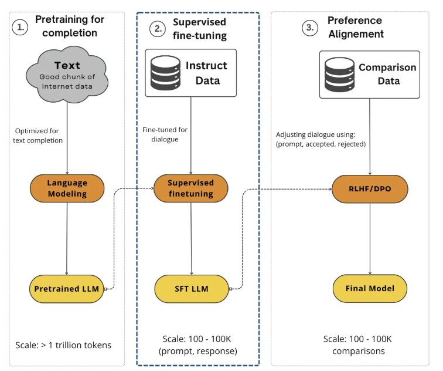

#### Reinforcement Learning from Human Feedback (RLHF)

- **Combines reinforcement learning (RL) with human input** to align models with human preferences and values
- **Response to traditional RL challenges:**
  - Difficulty specifying reward functions for complex tasks
  - Potential misalignment between engineered rewards and intended objectives

**Core RLHF Process:**

- **Reward model learning:**
  - Instead of pre-defined reward function, learns reward model from human feedback
  - Present humans with different answers, ask for preference indication
  - Use preferences to train reward model using Bradley-Terry model or similar approaches
  - Map preferences to underlying utility functions
- **Policy optimization:**
  - Use learned reward model with standard RL algorithms to optimize policy
  - Policy generates new behaviors aiming to maximize predicted rewards
- **Iterative improvement:**
  - Policy improvement generates new behaviors for human evaluation
  - Leads to reward model refinements
  - Continuous cycle ideally results in human preference-aligned policy

**Proximal Policy Optimization (PPO) Example:**

- **Popular RLHF algorithm** shown in high-level view
- **Reward model usage** - scores text generated by trained model
- **KL divergence regularization** - ensures token distribution similarity to frozen model before training

  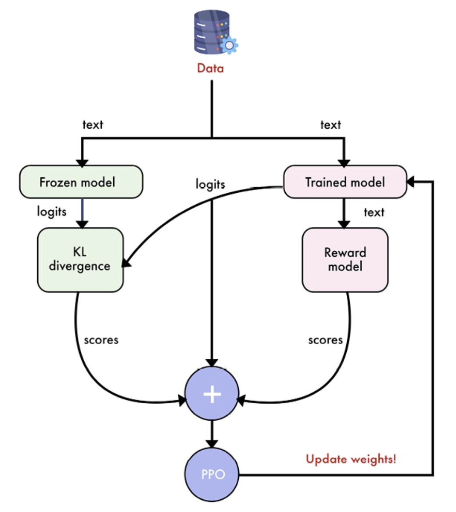

**RLHF Challenges:**

- **Computational expense** due to iterative nature and separate reward model requirement
- **Potential instability** from complex multi-component system
- **Experimental underperformance** - despite theoretical superiority, often underperforms simpler approaches

#### Direct Preference Optimization (DPO)

- **Core innovation** - reformulates preference learning problem for more direct approach
- **Eliminates complexity** of separate reward model and reinforcement learning algorithms like PPO
- **Mathematical insight** - derives closed-form expression for optimal policy under standard RLHF objective
- **Constraint handling** - maximizes expected reward subject to KL-divergence constraint with reference policy

**Implementation Advantages:**

- **Simple binary cross-entropy loss** operates directly on language model output probabilities
- **Dual encouragement approach:**
  - Higher probability for preferred responses
  - Lower probability for non-preferred responses
- **Reference model maintenance** - maintains closeness to reference (frozen) model
- **Beta parameter control** - directly controls reference model importance (between 0 and 1)
  - Beta = 0: reference model ignored (trained model can differ significantly from SFT)
  - Beta = 0.1: most popular value in practice
  - Adjustable based on specific requirements

**Process Simplification:**

- **Standard gradient descent optimization** - no sampling from model during training required
- **No complex RL algorithms** needed for implementation
- **Significantly simplified pipeline** vs. traditional RLHF methods

  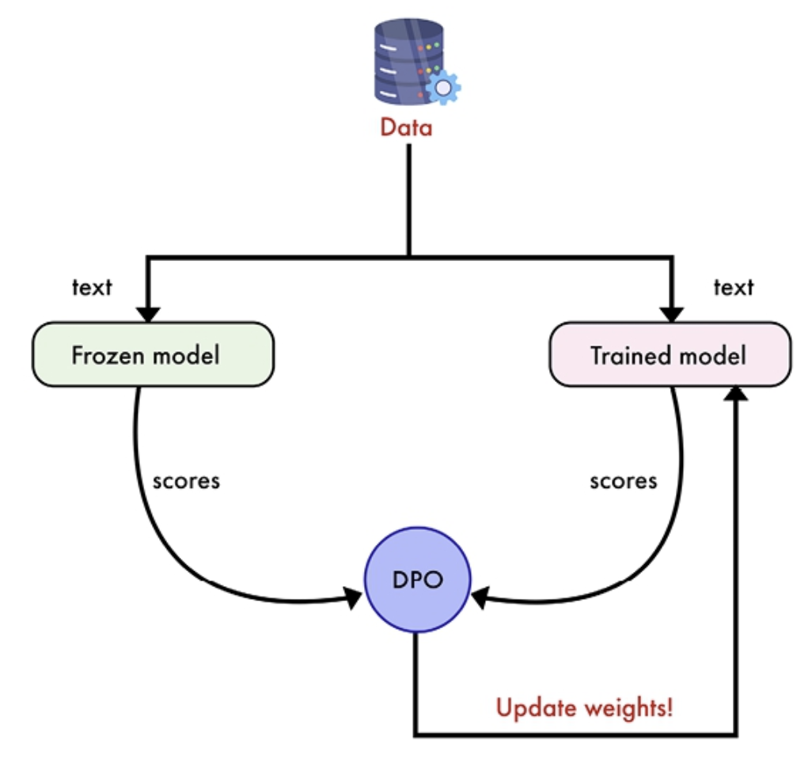

**DPO Advantages over RLHF:**

- **Engineering complexity reduction** - eliminates separate reward model and RL algorithm requirements
- **Computational efficiency** - more efficient than traditional RLHF approaches
- **Memory optimization** - especially when trained with adapters (LoRA, QLoRA)
  - Frozen and trained models don't need separation
  - Only adapters trained, original model unmodified
  - Single model loading instead of two saves additional VRAM

---

</details>

---
